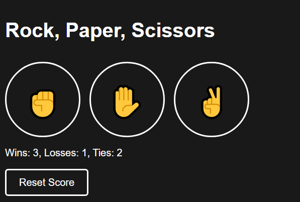

# Rock, Paper, Scissors Game 🎮✊✋✌️

Welcome to my **Rock, Paper, Scissors** game! This was one of my first projects, developed during high school while I was learning JavaScript.

## How to Play 🕹️

1. Open the `index.html` file in your web browser.
2. Choose your move by clicking one of the buttons: Rock ✊, Paper ✋, or Scissors ✌️.
3. The computer will instantly reveal its move, and you'll see the result.
4. Your score is displayed and updated after each round.
5. Use the **Reset Score** button to clear your stats whenever you like.

## Technology Stack 💻

This project was built using:

- **HTML**: For the basic structure of the web page.
- **CSS**: For styling the interface to make it visually appealing.
- **JavaScript**: To handle the game logic and interactivity.

## How to Run 🏃

1. Clone or download this repository.
2. Open the `index.html` file in any web browser.
3. Start playing and enjoy the game!

## Screenshot 📸

---

Thanks for checking out my project! 🎉
